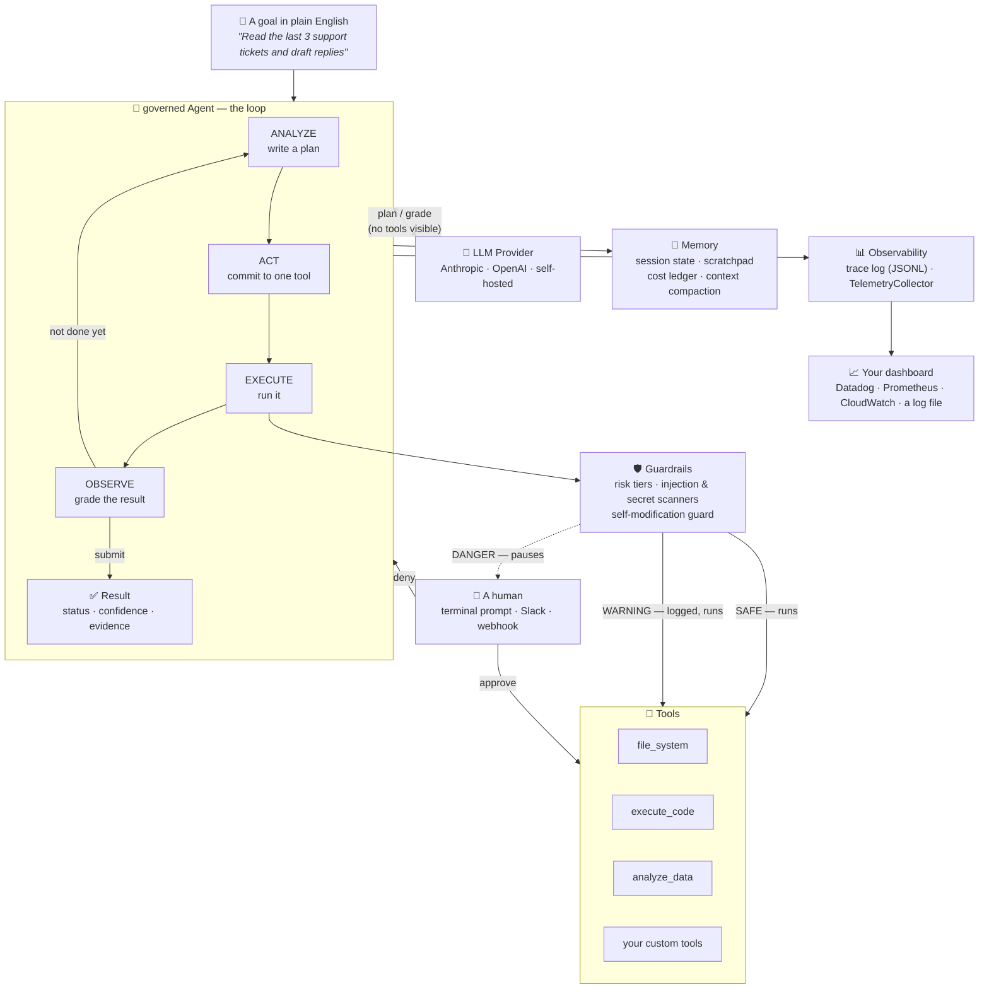

# The governed guide

This is the tour. [`README.md`](../README.md) is the reference — every class,
every config field, every guarantee, written for someone already writing
Python against this library. This document is for the question that comes
*before* that: **should I use this, for what, and what does it actually do?**
It assumes no prior familiarity with agent frameworks, and where it helps,
none with programming either.

---

## Table of contents

- [What this actually is](#what-this-actually-is)
- [Architecture, one diagram](#architecture-one-diagram)
- [Who uses this, and how](#who-uses-this-and-how)
- [Enterprise examples](#enterprise-examples)
  1. [Customer support triage](#1-customer-support-triage)
  2. [DevOps incident response](#2-devops-incident-response)
  3. [Financial document processing](#3-financial-document-processing)
  4. [Data analyst assistant](#4-data-analyst-assistant)
- [Integration points and credentials](#integration-points-and-credentials)
- [Deployment, step by step](#deployment-step-by-step)
- [What metrics come out of it](#what-metrics-come-out-of-it)
- [Where to go next](#where-to-go-next)

---

## What this actually is

Imagine you hired a new employee who is extremely capable but has one
condition: **before doing anything, they have to say out loud what they're
about to do and why — and after doing it, they have to show their work and
grade themselves against what they said would happen.** If what they're about
to do is risky — delete something, run a command, spend money — they have to
stop and ask a manager first. Everything they do gets written down, so you
can read the log afterwards and see exactly what happened and why, without
having to trust their word for it.

That employee is what `governed` builds. The "employee" is a large language
model (Claude, GPT, or a self-hosted model — you choose). The discipline
around it — the forced plan-before-action, the self-grading, the manager who
gets asked before anything dangerous, the paper trail — is what this
framework provides. Most "AI agent" tooling gives the model a pile of tools
and a loop and hopes for the best. This one makes each step a checkable
promise instead of a hope.

**In one sentence:** you give it a goal in plain English, a sandboxed
workspace, and a set of tools; it works the goal through a disciplined
plan → act → check loop, asks a human before doing anything dangerous, and
hands back a structured result you can trust because you can see the
reasoning that produced it.

---

## Architecture, one diagram



Reading it left to right: **you** state a goal. The **Agent** turns that goal
into a loop of plan → act → check, talking to an **LLM provider** to do the
"thinking" parts (planning and grading — notice the model is never handed
tools during those two steps; it can't act while it's supposed to be
thinking). Every action passes through **Guardrails** first, which decide
whether it's safe to just run, safe-but-worth-logging, or dangerous enough
that a **human** needs to say yes. Actions that clear that gate reach the
**Tools** — file access, code execution, data analysis, or anything custom
you add. Throughout the run, **Memory** keeps track of what's been tried and
what it costs, and **Observability** writes down everything that happened and
tracks the operational numbers (latency, cost, safety events) that feed into
whatever dashboard you already use.

Nothing here is exotic. It's the same shape as any well-run process with a
junior employee and a manager: propose, check, act, verify, escalate when
unsure, keep a paper trail.

---

## Who uses this, and how

**If you're a developer:** `governed` is a Python library. You install it,
write a few lines of configuration (which model, which tools, what counts as
"dangerous" for your use case), and call `agent.run("your goal")`. The
[Sixty-second example](../README.md#sixty-second-example) in the README is
the whole on-ramp.

**If you're not a developer:** you won't touch this library directly — but
you will very likely end up *using* something built with it. A developer on
your team wraps an `Agent` behind something you already know how to use: a
Slack command, an internal web form, a scheduled report that lands in your
inbox. Your job is to describe the goal ("triage this queue," "summarize
this week's incidents") and, when the framework flags something as risky, to
be the person who says yes or no at the approval prompt. You do not need to
read a line of Python to be the "human" in "human-in-the-loop" — the
approval message is plain English, showing the tool, the exact arguments,
and why it was flagged (see [the HITL walkthrough](#2-devops-incident-response)
below for what that message actually looks like).

The one thing worth understanding regardless of role: **this framework is
opinionated about safety by construction, not by promise.** It doesn't ask
the model to please be careful — it puts a sandbox, a permission gate, and an
audit log between "the model decided to do something" and "that thing
actually happened." That's the difference between "we told the AI not to
delete production data" and "the AI does not have a code path that reaches
production data without a human clicking approve."

---

## Enterprise examples

Each of these is a realistic shape, not a toy. Full configuration reference is
in the [README](../README.md#configuration-reference); these show the
decisions that matter for each scenario.

Each example below constructs `AnthropicClient` directly for brevity. In a
real deployment the provider and model are usually deployment configuration,
not a code choice — pass `llm=LLMConfig(provider="anthropic", model=..., api_key=...)`
instead, sourced from your config/secret store, and switch providers by
changing that config. See [Configuring the LLM by config](../README.md#configuring-the-llm-by-config).

### 1. Customer support triage

**Goal:** read incoming tickets, draft replies, auto-send the easy ones,
escalate refunds and account deletions to a human.

```python
from governed import (
    Agent, AgentConfig, Budget, GuardrailConfig, RiskPolicy, RiskTier,
    WebhookApprover, CircuitBreakerConfig, TelemetryCollector,
)
from governed.llm import AnthropicClient

# Refunds and account changes escalate no matter what tool touches them --
# this is a custom escalation rule layered on top of the built-in tiers.
def escalate_money_and_deletions(spec, args) -> RiskTier | None:
    text = str(args).lower()
    if "refund" in text or "delete_account" in text or "cancel_subscription" in text:
        return RiskTier.DANGER
    return None

telemetry = TelemetryCollector()
agent = Agent(AgentConfig(
    llm=AnthropicClient(model="claude-sonnet-5"),
    workspace="./support_workspace",
    guardrails=GuardrailConfig(
        risk_policy=RiskPolicy(escalations=[escalate_money_and_deletions]),
        approver=WebhookApprover("https://hooks.internal/support-approvals"),
    ),
    budget=Budget(max_iterations=10),
    circuit_breaker=CircuitBreakerConfig(max_usd=0.50),   # per ticket
    subscribers=[telemetry],
))

result = agent.run("Triage ticket #48213 and draft or send a reply.")
```

A routine "where's my order" question runs and sends unattended. A refund
request stops, posts the drafted refund amount and the customer's message to
the support lead's Slack via the webhook, and waits. Nobody has to trust the
model's judgment about what counts as sensitive — the rule is code, and the
audit trail (`telemetry.overview()`, the trace file) tells you exactly how
often it fired.

### 2. DevOps incident response

**Goal:** read recent logs and metrics, propose a fix, never restart a
production service without a person confirming.

`execute_code` and anything that shells out is `DANGER`-tier by default —
exactly the tool an incident-response agent needs and exactly the one that
should stop for a human. With `TerminalApprover`, the on-call engineer sees:

```
======================================================================
APPROVAL REQUIRED  [DANGER]  iteration 4
  goal: Investigate the checkout-service 500 spike and propose a fix.
  tool: execute_code
  args: {"language": "bash", "code": "sudo systemctl restart checkout-service"}
  ⚡ DST005 [WARN] Privilege escalation.
======================================================================
  approve? y/N >
```

That's the whole interaction: the exact command, why it was flagged, one
keypress to decide. Nothing runs until they answer. If they deny it, the
denial goes back to the model as a structured reason, not a silent failure —
the agent can propose an alternative instead of retrying blind.

### 3. Financial document processing

**Goal:** extract line items from vendor invoices, flag anomalies, never
touch anything outside the intake folder.

```python
from governed import (
    Agent, AgentConfig, GuardrailConfig, AllowTierApprover, RiskTier, default_tools,
)

agent = Agent(AgentConfig(
    llm=AnthropicClient(model="claude-sonnet-5"),
    workspace="./intake",                      # the sandbox boundary
    tools=default_tools(include_code_execution=False),  # no shell, ever
    guardrails=GuardrailConfig(
        approver=AllowTierApprover(RiskTier.WARNING),   # never delete, never shell out
    ),
    extra_instructions=(
        "Flag any invoice where the line-item total does not match the "
        "stated total, or where the vendor is not in vendors.csv."
    ),
))
```

With `execute_code` left out of `tools`, this agent physically cannot run a
shell command — the tool isn't registered, so there's no gate to bypass. For
a workload handling financial documents, "the capability doesn't exist" is a
stronger guarantee than "the capability is gated," and it costs nothing to
choose when you don't need the capability.

### 4. Data analyst assistant

**Goal:** let a non-technical stakeholder ask questions about a dataset in
plain English, safely, without SQL or Python.

```python
result = agent.run(
    "Using data/q3_sales.csv, which region had the steepest month-over-month "
    "decline, and what's a plausible explanation looking at the data alone?"
)
print(result.answer)
print(f"confidence: {result.confidence:.0%}")
if result.unmet_requirements:
    print("Could not fully answer:", result.unmet_requirements)
```

This is the shape a Slack bot or internal web form wraps: take a plain-English
question, run it, show `result.answer` and `result.confidence`. The person
asking the question never needs to know `analyze_data` exists — they typed a
sentence and got a cited answer back, with an honest admission of what it
couldn't determine.

---

## Integration points and credentials

`governed` holds no credentials itself. It calls out through objects you
configure, and each one needs whatever *that* system needs — nothing more.

| You want... | You configure | You need |
|---|---|---|
| The model that does the thinking | `AgentConfig(llm=...)` | An `ANTHROPIC_API_KEY` or `OPENAI_API_KEY`, or nothing at all for a self-hosted model behind `base_url` |
| Runs to survive a restart | `AgentConfig(store=...)` | A writable directory (`JSONFileStore`), or credentials for whatever database backs your own `StateStore` |
| A human to approve risky actions | `GuardrailConfig(approver=...)` | Nothing (`TerminalApprover`), or a webhook URL + auth header for Slack/Teams/ServiceNow (`WebhookApprover`) |
| A second, cheap model to catch prompt injection | `GuardrailConfig(semantic_scanner=...)` | A second API key — deliberately *not* the agent's own, so a compromised classifier can't spend the agent's budget |
| Metrics in your existing dashboard | `AgentConfig(subscribers=[...])` | Whatever client library your metrics backend needs — the `Subscriber` you write is nine lines, see [below](#what-metrics-come-out-of-it) |
| Custom tools (a database, an internal API) | `AgentConfig(tools=[...])` | Whatever that system needs, read from the environment inside your tool, same as any backend service |

The only credential every deployment needs is the LLM API key. Everything
else is opt-in, and each integration fails independently — a metrics backend
being down does not stop a run; an unreachable approver denies the specific
call it was asked about, not the whole session.

---

## Deployment, step by step

1. **Install** `pip install 'governed[anthropic,data]'` into your service or
   container image.
2. **Put the LLM API key in a secret manager**, not the image or the repo.
3. **Decide your risk posture before you write the prompt.** An unattended
   batch job gets `AllowTierApprover(RiskTier.WARNING)` — read and write
   freely, never delete or shell out without a person. Anything that can
   reach `DANGER`-tier actions gets a real `Approver` wired to a human.
4. **Point the workspace at a scratch volume.** The sandbox enforces "stay
   inside this directory" — make that directory one you mean.
5. **Set a cost ceiling.** `CircuitBreakerConfig(max_usd=...)`. This is the
   one control with no safe default; only you know what the task is worth.
6. **Wire telemetry and the trace log out** before the first production run —
   see the next section for exactly what you get.
7. **Run the test suite in CI.** It's ~120 tests against a scripted, offline
   LLM client — no API key, no network, no excuse not to run it on every PR.

```dockerfile
FROM python:3.12-slim
WORKDIR /app
COPY pyproject.toml .
RUN pip install --no-cache-dir '.[anthropic,data]'
COPY . .
# ANTHROPIC_API_KEY and any webhook URLs come from the orchestrator's
# secret store at run time -- never baked into the image.
CMD ["python", "run_agent.py"]
```

One caveat worth repeating here because it's the one people skip: if
`execute_code` is enabled and the goal can be influenced by untrusted input
(a public form, an open inbox), the in-process resource limits are a
seatbelt, not a cage. Either disable the tool
(`default_tools(include_code_execution=False)`) or run the whole agent inside
a properly locked-down container. Full detail in the README's
[Safety](../README.md#safety) section.

---

## What metrics come out of it

Attach `TelemetryCollector` (a `Subscriber`, same mechanism as the trace
logger) and you get, for free, from events the agent already emits:

| Metric | What it tells you |
|---|---|
| **LLM request count, latency, status, tokens** — overall and per phase | Is the model slow or erroring, and in which part of the loop (planning, acting, or grading)? |
| **Tool/dependency latency and success rate**, per tool name | Is a third-party API or database behind a tool degrading — as opposed to the model just thinking slowly, which looks identical in raw wall-clock time |
| **Session time: total vs. active vs. HITL idle** | Did a run take twenty minutes because the agent was slow, or because a human was away from the approval prompt? |
| **Running cost in USD** | What did this run actually cost, read straight off the priced ledger |
| **Blocked calls, circuit-breaker trips, budget exhaustions** | How often does this deployment refuse something dangerous, and of what kind — a fleet-wide safety signal, not a per-run one |

```python
telemetry = TelemetryCollector()
agent = Agent(AgentConfig(llm=..., subscribers=[telemetry]))
result = agent.run(goal)

telemetry.overview()
```

```json
{
  "total_run_time_s": 4.2,
  "active_time_s": 4.1,
  "idle_wait_s": 0.1,
  "llm_requests": 5,
  "llm_success_rate": 1.0,
  "total_tokens": 2140,
  "total_cost_usd": 0.0143,
  "tool_calls": 2,
  "tool_success_rate": 1.0,
  "blocked_calls": 0,
  "circuit_trips": 0,
  "budget_exhaustions": 0
}
```

That's the whole "how is this deployment doing" answer in one dict — total
run time and token usage, exactly as asked for, alongside cost and safety so
they don't have to be reconstructed from the trace by hand. `to_dict()`
returns the full breakdown (per-phase, per-tool, per-session) if you need
more than the rollup. There's no built-in exporter to Prometheus or Datadog
on purpose — the shape you want depends on your backend, and a `Subscriber`
that pushes a metric on every event is a few lines:

```python
def push_to_statsd(event):
    if event.type is EventType.TOOL_RESULT:
        name = event.data["tool"]
        statsd.timing(f"governed.tool.{name}.latency_ms", event.data["duration_ms"])
        statsd.increment(f"governed.tool.{name}.{'ok' if event.data['ok'] else 'error'}")

agent = Agent(AgentConfig(llm=..., subscribers=[telemetry, push_to_statsd]))
```

Full reference: [Telemetry & metrics](../README.md#6-telemetry--metrics) in
the README.

---

## Where to go next

- Never run this before? [Sixty-second example](../README.md#sixty-second-example).
- Deploying entirely from a config file, no Python glue? [Config-first bootstrapping](../README.md#config-first-bootstrapping).
- Adding a tool for your own system? [Adding a tool](../README.md#adding-a-tool).
- Deciding what should require human approval? [Guardrails](../README.md#7-guardrails).
- Screening generated content for harmful intent, policy violations, bias, or
  unsafe behaviour before it runs? [Content safety screening](RESPONSIBLE_AI.md#2a-content-safety-screening-the-responsible-ai-execution-layer).
- Setting a deployment-wide policy (allowed tools, allowed models, approval
  threshold)? [Governance](../README.md#7a-governance-deployment-wide-policy).
- Need a tamper-evident audit trail you can stream to Splunk, Datadog, New
  Relic, Dynatrace, or an OTel Collector? [The decision ledger](../README.md#5a-the-decision-ledger-tamper-evident-and-exportable).
- Setting a budget you can defend to finance? [Cost, context, and the circuit breaker](../README.md#8-cost-context-and-the-circuit-breaker).
- Shipping this to production and need to demonstrate it's governed? [Responsible AI usage](RESPONSIBLE_AI.md).
- Shipping this to production? [Enterprise deployment](../README.md#enterprise-deployment).
